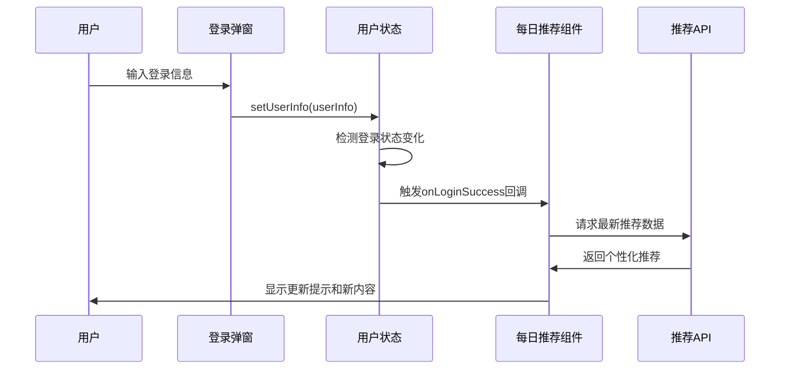

# 登录成功后刷新每日推荐功能

## 🎯 功能概述

实现了用户登录成功后自动刷新每日推荐数据的功能，确保用户在登录后能够获得个性化的推荐内容。

## 🔧 技术实现

### 1. 用户状态管理增强 (`src/store/userStore.ts`)

- **新增登录成功回调机制**：
  - 添加 `onLoginSuccess` 回调函数属性
  - 添加 `setOnLoginSuccess` 方法来设置回调
  - 在 `setUserInfo` 方法中检测登录状态变化并触发回调

```typescript
// 登录成功回调
onLoginSuccess?: () => void;
// 设置登录成功回调
setOnLoginSuccess: (callback?: () => void) => void;
```

### 2. 每日推荐组件增强 (`src/components/DailyRecommendations.tsx`)

- **登录成功监听**：
  - 在组件挂载时设置登录成功回调
  - 登录成功时自动刷新每日推荐数据
  - 组件卸载时清理回调函数

- **手动刷新功能**：
  - 添加刷新按钮，支持手动刷新
  - 刷新时显示加载状态和成功提示

```typescript
// 设置登录成功回调
useEffect(() => {
  setOnLoginSuccess(() => {
    console.log('🎉 用户登录成功，刷新每日推荐');
    refreshDailyRecommendations();
  });

  return () => {
    setOnLoginSuccess(undefined);
  };
}, [setOnLoginSuccess]);
```

## 🎨 用户体验

### 自动刷新流程
1. 用户打开应用，查看默认的每日推荐
2. 用户进行登录（手机号/账号/二维码任一方式）
3. 登录成功后，系统自动刷新每日推荐
4. 显示"每日推荐已更新"的成功提示
5. 用户看到个性化的推荐内容

### 手动刷新功能
- 在每日推荐标题旁添加刷新按钮
- 点击刷新按钮可手动更新推荐内容
- 刷新时按钮显示旋转动画
- 刷新完成后显示成功提示

## 🔄 工作流程



## 📋 测试方法

### 自动刷新测试
1. 打开应用（未登录状态）
2. 观察当前每日推荐内容
3. 点击用户头像，选择登录
4. 完成登录流程
5. 观察每日推荐是否自动刷新并显示提示

### 手动刷新测试
1. 在每日推荐区域找到刷新按钮（🔄图标）
2. 点击刷新按钮
3. 观察按钮旋转动画和加载状态
4. 确认刷新完成后显示成功提示

## 🎉 功能特点

- ✅ **自动化**：登录成功后无需手动操作，自动刷新
- ✅ **用户友好**：提供清晰的视觉反馈和成功提示
- ✅ **性能优化**：只在登录状态变化时触发刷新
- ✅ **内存安全**：组件卸载时自动清理回调函数
- ✅ **手动控制**：提供手动刷新选项
- ✅ **状态管理**：正确处理加载和错误状态

## 🔧 技术细节

### 状态管理
- 使用 Zustand 进行状态管理
- 回调函数存储在用户状态中
- 支持动态设置和清理回调

### 组件生命周期
- 组件挂载时设置回调
- 组件卸载时清理回调
- 避免内存泄漏

### 错误处理
- 网络请求失败时显示错误状态
- 提供重试机制
- 用户友好的错误提示

这个功能确保了用户在登录后能够立即享受到个性化的音乐推荐体验！
